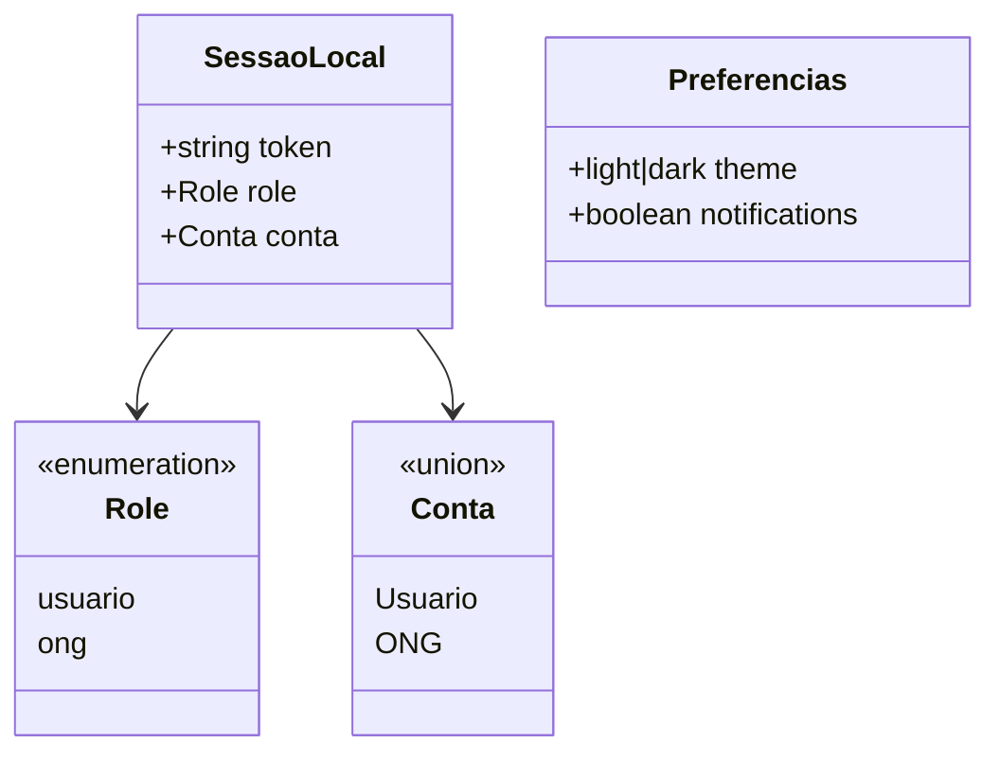

# Armazenamento local

## Papel no aplicativo

O armazenamento local preserva a sessão e as preferências entre execuções. O projeto separa o token dos demais valores para aplicar proteção adicional nas plataformas nativas.

## Tecnologias

| Tecnologia | Plataformas | Uso |
| --- | --- | --- |
| [Expo SecureStore](https://docs.expo.dev/versions/v54.0.0/sdk/securestore/) | Android e iOS | Token da sessão |
| [AsyncStorage](https://react-native-async-storage.github.io/) | Android, iOS e web | Conta, papel e preferências; token apenas na web |

AsyncStorage é um armazenamento persistente de chave/valor. Valores estruturados são serializados com `JSON.stringify` e restaurados com `JSON.parse`.

## Chaves persistidas

| Chave | Armazenamento | Tipo lógico | Responsável | Finalidade |
| --- | --- | --- | --- | --- |
| `@app:token` | SecureStore no nativo; AsyncStorage na web | string | `tokenStorage.ts` | Token da sessão |
| `@app:role` | AsyncStorage | `usuario \| ong` | `authServices.ts` | Define as rotas disponíveis |
| `@app:conta` | AsyncStorage | JSON de `Usuario \| ONG` | `authServices.ts` e `AuthContext.tsx` | Restaura e atualiza a conta ativa |
| `@app:theme` | AsyncStorage | `light \| dark` | `ThemeContext.tsx` | Preserva o tema escolhido |
| `@app:notifications` | AsyncStorage | `true \| false` serializado | `ConfiguracoesScreen.tsx` | Preserva a preferência visual de notificações |

## Estrutura lógica dos dados locais

Campanhas e doações não são persistidas pelo armazenamento local; esses itens permanecem no estado em memória das telas enquanto o app está aberto.

## Ciclo de vida da sessão

### Gravação

1. `AuthContext.login()` recebe os dados da sessão.
2. `authService.salvarSessao()` grava o token por `tokenStorage`.
3. Papel e conta são gravados em lote com `AsyncStorage.multiSet()`.
4. O contexto atualiza `conta` e `role` em memória.

Se qualquer gravação falhar, `salvarSessao()` executa a limpeza para não deixar uma sessão parcial.

### Restauração

1. `AuthProvider` inicia com `loading = true`.
2. `getSessaoSalva()` lê token, conta e papel em paralelo.
3. A ausência de qualquer parte invalida a restauração.
4. O papel precisa ser exatamente `usuario` ou `ong`.
5. Quando o token contém `exp`, a data é comparada com o relógio atual.
6. Uma sessão expirada é removida.
7. Uma sessão válida atualiza o contexto e libera a navegação.

### Atualização da conta

`atualizarConta()` combina os dados existentes com os novos valores, atualiza o estado React e substitui `@app:conta`. `atualizarFoto()` reutiliza esse fluxo alterando apenas `foto`.

### Encerramento

`logout()` remove token, papel e conta. O contexto recebe valores nulos e `AppRoutes` substitui as telas autenticadas pelas telas públicas.

## Migração do token

`tokenStorage.ts` possui compatibilidade com instalações anteriores:

1. procura o token no SecureStore;
2. se não encontrar, consulta `@app:token` no AsyncStorage;
3. move o valor encontrado para o SecureStore;
4. remove a cópia antiga do AsyncStorage.

Esse processo ocorre somente em plataformas nativas. A web continua usando AsyncStorage porque SecureStore não está disponível nesse ambiente.

## Preferência de tema

- Sem `@app:theme`, o app acompanha `useColorScheme()`.
- Com valor `light` ou `dark`, a escolha manual tem prioridade.
- `toggleTheme()` atualiza primeiro a interface e depois persiste a preferência.
- Valores diferentes de `light` e `dark` são ignorados na leitura.

## Preferência de notificações

`@app:notifications` controla apenas o estado do switch na tela de configurações. O valor padrão é `true`. Se a gravação falhar, a tela restaura o valor anterior e exibe um alerta.

## Segurança local

- Senhas não são gravadas pelo aplicativo.
- O token usa SecureStore no Android/iOS com `WHEN_UNLOCKED_THIS_DEVICE_ONLY`.
- Dados de perfil e preferências permanecem no AsyncStorage e não devem ser tratados como secretos.
- A exclusão e o logout removem os dados de sessão local.
- A web possui limitações próprias porque utiliza AsyncStorage para o token.

## Tratamento de falhas

- Falha ao restaurar a sessão aciona limpeza e encerra o loading.
- Falha ao salvar tema mantém a interface funcional e gera alerta na tela.
- Falha ao salvar notificações desfaz a alteração visual.
- Uma sessão incompleta não é considerada autenticada.

## Arquivos relacionados

| Arquivo | Responsabilidade |
| --- | --- |
| `src/services/tokenStorage.ts` | Leitura, gravação, remoção e migração do token |
| `src/services/authServices.ts` | Persistência e restauração dos dados da sessão |
| `src/contexts/AuthContext.tsx` | Estado React da conta e sincronização de alterações |
| `src/contexts/ThemeContext.tsx` | Persistência da preferência de tema |
| `src/screens/ConfiguracoesScreen.tsx` | Persistência da preferência de notificações |

## Recomendações de manutenção

- manter tokens exclusivamente em `tokenStorage.ts`;
- nunca persistir senha ou conteúdo de formulário sensível;
- versionar mudanças no formato de `@app:conta` quando os modelos evoluírem;
- manter a limpeza idempotente, permitindo chamadas repetidas sem erro;
- criar testes para restauração válida, token expirado, migração e falhas de gravação.
