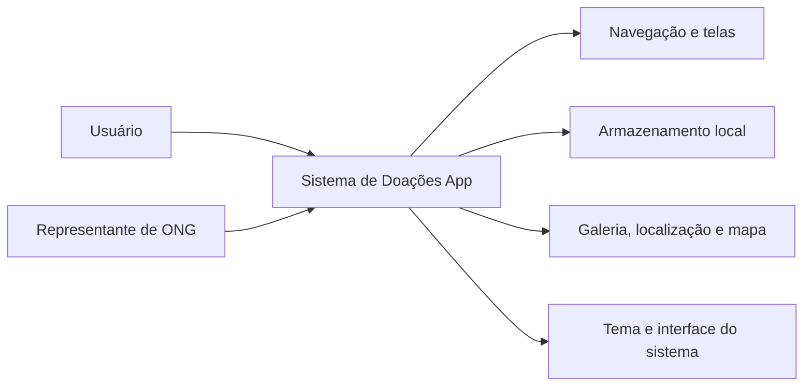
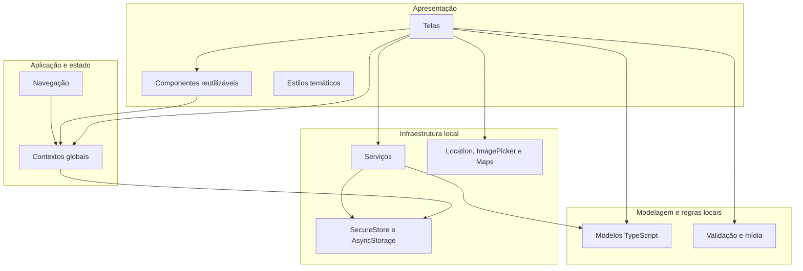
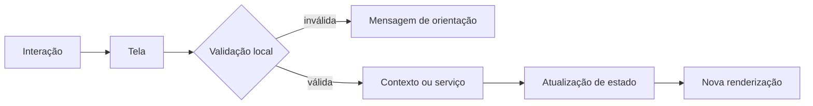

# Visão geral e arquitetura

## Papel do componente

Este repositório implementa o componente **app** do Sistema de Doações. Ele reúne a interface, os fluxos de interação e os recursos locais necessários para atender dois perfis: usuário e ONG.

Suas responsabilidades são:

- renderizar a experiência em Android, iOS e web;
- coletar e validar dados dos formulários;
- controlar autenticação, conta ativa e tipo de perfil;
- proteger a navegação conforme o estado da sessão;
- apresentar campanhas, doações, perfil e configurações;
- selecionar imagens e coordenadas geográficas;
- persistir sessão e preferências no dispositivo;
- aplicar tema claro ou escuro em toda a interface.

## Visão funcional

## Tecnologias

### Núcleo da aplicação

| Tecnologia | Responsabilidade |
| --- | --- |
| [React 19](https://react.dev/) | Componentes funcionais, hooks, contexto e atualização da interface |
| [React Native 0.81](https://reactnative.dev/docs/0.81/getting-started) | Componentes visuais compartilhados entre plataformas móveis |
| [React Native Web](https://necolas.github.io/react-native-web/) | Adaptação da interface para navegadores |
| [Expo SDK 54](https://docs.expo.dev/versions/v54.0.0/) | Execução, empacotamento, configuração e módulos nativos |
| [TypeScript](https://www.typescriptlang.org/docs/) | Tipagem de modelos, propriedades, estado e rotas |

### Navegação e interface

| Tecnologia | Responsabilidade |
| --- | --- |
| [React Navigation](https://reactnavigation.org/docs/getting-started/) | Pilha de navegação, transições e parâmetros tipados |
| [React Native Screens](https://docs.expo.dev/versions/v54.0.0/sdk/screens/) | Integração da pilha com telas nativas |
| [Safe Area Context](https://docs.expo.dev/versions/v54.0.0/sdk/safe-area-context/) | Respeito a recortes, notch e barras do sistema |
| [Expo StatusBar](https://docs.expo.dev/versions/v54.0.0/sdk/status-bar/) | Contraste da barra de status conforme o tema |
| [Expo SystemUI](https://docs.expo.dev/versions/v54.0.0/sdk/system-ui/) | Sincronização da cor da view raiz |
| [Expo SplashScreen](https://docs.expo.dev/versions/v54.0.0/sdk/splash-screen/) | Tela de abertura clara e escura |
| [Vector Icons](https://docs.expo.dev/guides/icons/) | Ícones Feather e AntDesign |

### Estado e armazenamento

| Tecnologia | Responsabilidade |
| --- | --- |
| [AsyncStorage](https://react-native-async-storage.github.io/) | Preferências, conta e tipo de perfil |
| [Expo SecureStore](https://docs.expo.dev/versions/v54.0.0/sdk/securestore/) | Proteção do token da sessão em Android/iOS |
| [jwt-decode](https://github.com/auth0/jwt-decode) | Leitura local de identificação e expiração da sessão |

### Recursos do dispositivo

| Tecnologia | Responsabilidade |
| --- | --- |
| [Expo Location](https://docs.expo.dev/versions/v54.0.0/sdk/location/) | Permissão e obtenção de latitude/longitude |
| [React Native Maps](https://github.com/react-native-maps/react-native-maps) | Mapa, marcador e seleção manual no app nativo |
| [Expo ImagePicker](https://docs.expo.dev/versions/v54.0.0/sdk/imagepicker/) | Seleção e recorte de imagens da galeria |

### Comunicação encapsulada

| Tecnologia | Responsabilidade |
| --- | --- |
| [Axios](https://axios-http.com/docs/intro) | Base comum para as operações implementadas em `src/services` |

## Estilo arquitetural

O aplicativo adota uma **arquitetura em camadas orientada a componentes**. A separação é estabelecida pela responsabilidade dos diretórios, sem um framework adicional de gerenciamento de estado.

## Partes da arquitetura

### 1. Entrada da aplicação

Arquivos: `index.ts` e `src/App.tsx`.

- `index.ts` registra o componente raiz no ambiente Expo.
- `App.tsx` compõe `ThemeProvider`, `AuthProvider`, `StatusBar` e `AppRoutes`.
- A ordem dos providers permite que autenticação e navegação utilizem o tema.

### 2. Apresentação

Diretórios: `src/screens`, `src/components` e `src/styles`.

As telas coordenam cada fluxo completo. Elas mantêm estado temporário, validam formulários, acionam operações e apresentam alertas ou indicadores. Os componentes encapsulam elementos reutilizáveis, enquanto os arquivos de estilo convertem os tokens do tema em propriedades visuais.

Principais componentes:

| Componente | Papel |
| --- | --- |
| `Avatar` | Exibe foto de perfil ou ícone substituto |
| `BottomMenu` | Navega entre início, doações e perfil conforme o papel |
| `CampaignCard` | Resume e abre uma campanha |
| `Header` | Apresenta a ação de logout |
| `InputField` | Padroniza ícone, campo e cores |
| `LocationPickerMap` | Seleciona coordenadas no nativo ou localização atual na web |
| `PrimaryButton` | Padroniza ação principal, loading e acessibilidade |

### 3. Navegação

Diretório: `src/routes`.

- `types.ts` é a fonte de verdade para nomes e parâmetros.
- `AppRoutes.tsx` registra uma pilha nativa dinâmica.
- visitantes veem `Login` e `SignUp`;
- contas autenticadas recebem telas comuns;
- usuários recebem `Doacoes` e `EditarPerfil`;
- ONGs recebem `CriarCampanha`.

A documentação completa está em [navegacao.md](navegacao.md).

### 4. Estado global

Diretório: `src/contexts`.

#### AuthContext

Mantém `conta`, `role`, `loading` e `isAuthenticated`. Expõe login, logout, exclusão, atualização da foto e atualização dos dados locais. Na inicialização, tenta restaurar uma sessão válida antes de montar as rotas.

#### ThemeContext

Mantém a preferência de tema, a paleta ativa e o tema do React Navigation. Sem preferência manual, acompanha `useColorScheme()`. Também sincroniza o fundo externo à árvore React por meio do SystemUI.

### 5. Modelos e utilitários

Diretórios: `src/models` e `src/utils`.

Os modelos descrevem os objetos manipulados pela interface:

- `Usuario`;
- `ONG`;
- `Campanha`;
- `Doacao`;
- `GeoJSONPoint`.

`validation.ts` concentra as validações de CPF, CNPJ e e-mail. `media.ts` resolve referências de imagens locais, absolutas e relativas para uso pelos componentes.

### 6. Serviços

Diretório: `src/services`.

| Arquivo | Papel no aplicativo |
| --- | --- |
| `api.ts` | Cria a configuração compartilhada de comunicação e aplica o token salvo |
| `authServices.ts` | Agrupa operações de sessão, conta e foto |
| `campanhaService.ts` | Agrupa criação, atualização e exclusão de campanhas |
| `doacaoService.ts` | Agrupa criação, listagem, atualização e exclusão de doações |
| `tokenStorage.ts` | Abstrai a persistência protegida do token e a migração do formato antigo |

As telas não repetem a configuração dos serviços; elas chamam métodos com payloads tipados e atualizam o estado visual conforme o resultado.

### 7. Armazenamento local

O aplicativo utiliza dois mecanismos:

- SecureStore para o token em Android/iOS;
- AsyncStorage para conta, papel, tema, notificações e fallback web.

As chaves e o ciclo de vida estão documentados em [armazenamento-local.md](armazenamento-local.md).

### 8. Recursos nativos e web

- A galeria retorna um `ImagePickerAsset` com URI, nome e MIME.
- A localização utiliza precisão balanceada e pode aproveitar o último valor conhecido.
- O mapa nativo aceita toque e marcador.
- `LocationPickerMap.web.tsx` evita importar `react-native-maps` no navegador e apresenta uma alternativa compatível.

## Tema claro e escuro

O tema possui três níveis:

1. `src/styles/theme.ts` define tokens semânticos.
2. As fábricas `create*Styles(colors)` produzem estilos para a paleta ativa.
3. `ThemeContext` distribui cores e sincroniza React Navigation, StatusBar e SystemUI.

São exemplos de tokens: `background`, `surface`, `textPrimary`, `divider`, `danger` e `successSurface`. Essa abordagem evita decisões de cor espalhadas pelas telas.

## Fluxo interno de uma interação

## Decisões arquiteturais observadas

- Context API gerencia os dois estados realmente globais: sessão e tema.
- Estados de formulário e listagem permanecem próximos às telas.
- `useMemo` evita recriar folhas de estilo sem mudança de paleta.
- `useFocusEffect` atualiza listagens ao retornar para uma tela.
- Tipos de navegação impedem parâmetros incorretos em tempo de compilação.
- Componentes `.web.tsx` isolam diferenças de plataforma.
- Tokens sensíveis não compartilham o mesmo armazenamento das preferências em plataformas nativas.

## Melhorias futuras do app

- adicionar testes unitários para validações e armazenamento;
- criar testes de componentes e fluxos de navegação;
- configurar deep links para a versão web;
- centralizar mensagens e tratamento visual de erros;
- acrescentar acessibilidade automatizada e testes em dispositivos;
- padronizar formatação de CPF, CNPJ, telefone e datas;
- implementar notificações, atualmente limitadas a uma preferência local.
