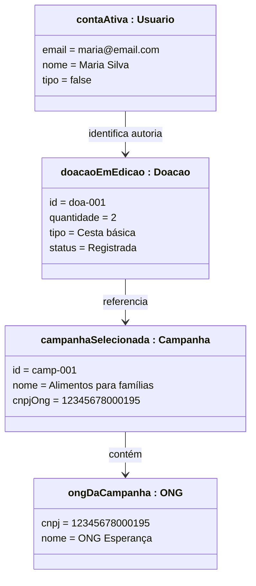
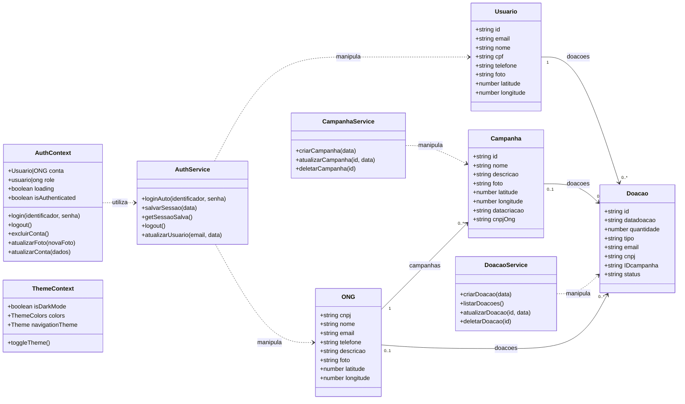
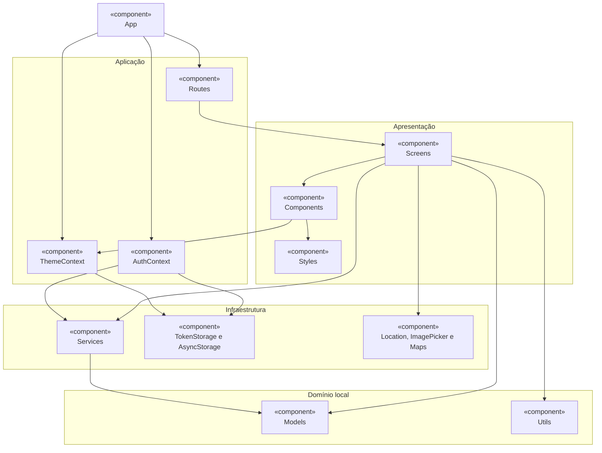
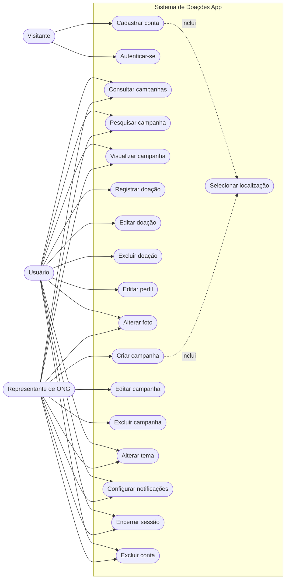
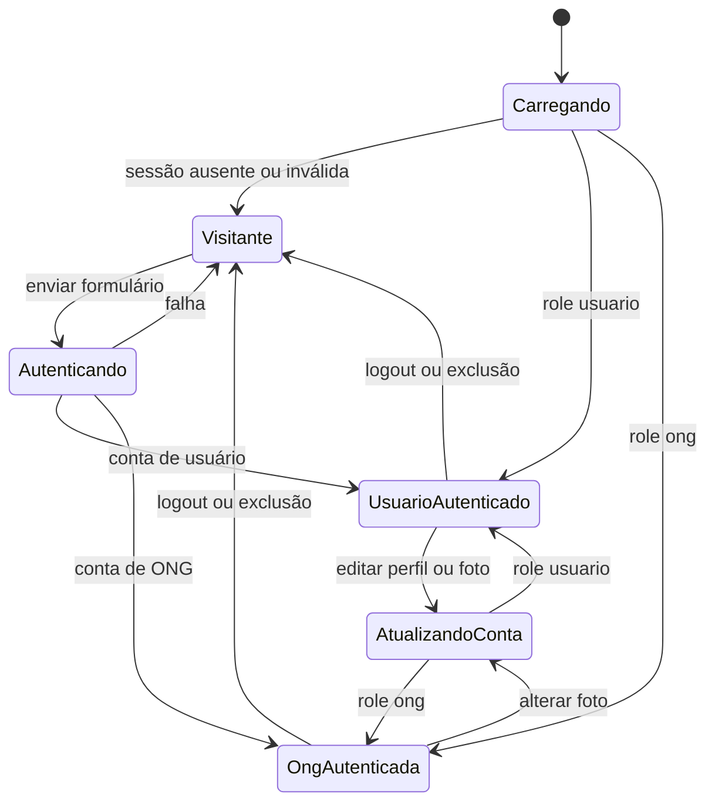
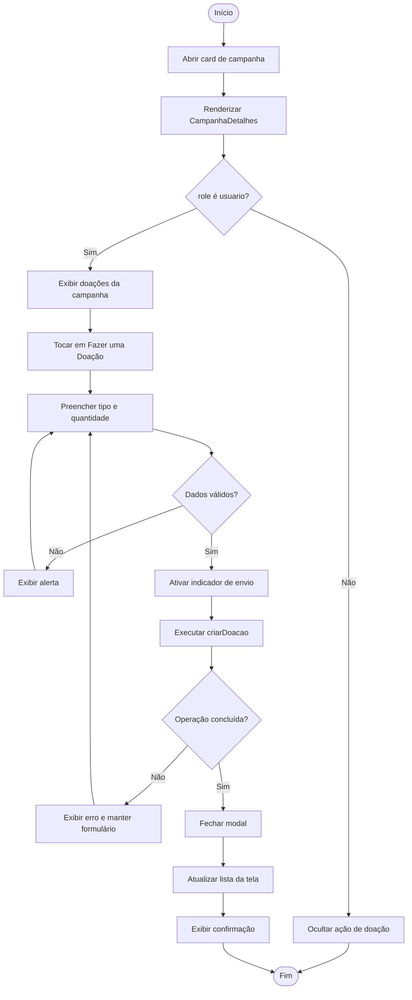
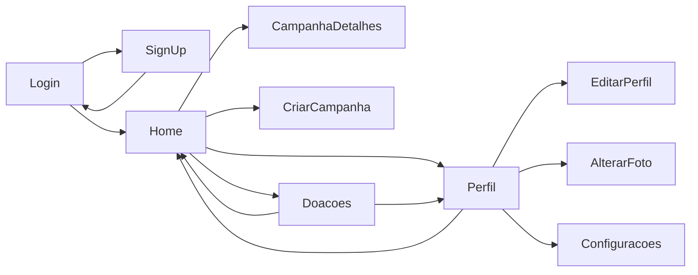

# Diagramas UML

Os diagramas usam [Mermaid](https://mermaid.js.org/), formato textual renderizado pelo GitHub. Todos representam arquivos, estados e interações presentes no aplicativo.

## 1. Diagrama de objetos

O diagrama de objetos apresenta uma fotografia de instâncias manipuladas pela interface. Os valores abaixo são ilustrativos.

### Leitura do diagrama de objetos

- `contaAtiva` representa o valor mantido no `AuthContext`.
- `campanhaSelecionada` é recebido por `CampanhaDetalhes` em `route.params`.
- `doacaoEmEdicao` representa um item da lista no estado local da tela.
- `ongDaCampanha` corresponde à relação opcional `campanha.ong`.

## 2. Diagrama de classes

O diagrama reúne os modelos TypeScript, contextos e serviços presentes no código.

### Leitura do diagrama de classes

- `Usuario`, `ONG`, `Campanha` e `Doacao` são interfaces TypeScript.
- Contextos mantêm estado compartilhado e oferecem ações às telas.
- Serviços encapsulam operações por área funcional.
- As associações entre modelos correspondem às propriedades opcionais definidas em `src/models`.

## 3. Diagrama de componentes

O diagrama mostra a decomposição interna do aplicativo e suas dependências.

### Leitura do diagrama de componentes

- `App` compõe providers e navegação.
- `Routes` decide quais telas pertencem à árvore atual.
- `Screens` coordenam os fluxos e reutilizam componentes.
- `Contexts` distribuem sessão e tema.
- `Services`, `Storage` e módulos nativos concentram detalhes de infraestrutura.
- `Models` e `Utils` mantêm contratos e regras locais reutilizáveis.

## 4. Diagrama de casos de uso

### Leitura do diagrama de casos de uso

- Visitantes acessam cadastro e autenticação.
- Usuários controlam perfil e doações.
- ONGs controlam perfil e campanhas.
- Tema, foto, configurações e sessão aparecem conforme o acesso da tela.
- A localização é opcional no cadastro e utilizada na criação/edição de campanha.

## 5. Diagrama de estados da sessão

### Leitura do diagrama de estados

- O estado `Carregando` evita exibir uma rota incorreta durante a restauração.
- `Visitante` possui somente as rotas públicas.
- O papel da conta define um dos dois estados autenticados.
- A atualização da conta preserva o papel e substitui os dados em memória.
- Logout ou exclusão limpam o contexto e retornam à árvore pública.

## 6. Diagrama de atividades — registrar uma doação

### Leitura do diagrama de atividades

- A ação existe somente para `role === usuario`.
- Tipo deve possuir texto e quantidade deve ser numérica e maior que zero.
- O indicador evita múltiplos envios durante a operação.
- Sucesso fecha o modal e atualiza a lista; falha preserva o contexto de edição.

## Diagrama complementar de navegação

As arestas apresentam transições possíveis; `CriarCampanha` pertence à ONG e `Doacoes`/`EditarPerfil` pertencem ao usuário. O catálogo completo está em [navegacao.md](navegacao.md).

## Manutenção dos diagramas

Quando uma tela, modelo ou fluxo mudar:

1. atualize a implementação correspondente;
2. revise o catálogo em [navegacao.md](navegacao.md);
3. atualize os diagramas afetados;
4. renderize o Markdown em um ambiente compatível com Mermaid;
5. execute a validação Markdown antes de entregar a alteração.
