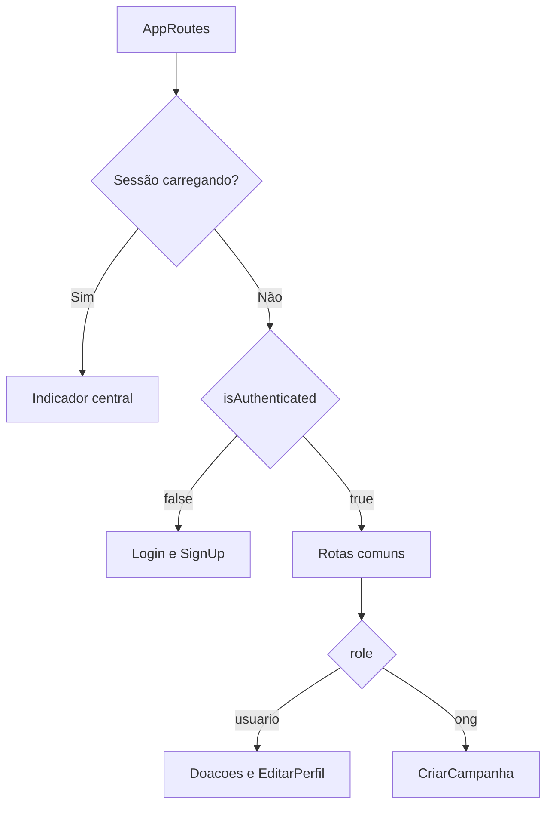

# Navegação

## Visão geral

O aplicativo utiliza `NavigationContainer` e `createNativeStackNavigator` do React Navigation. Todas as rotas são tipadas por `RootStackParamList`, declarado em `src/routes/types.ts`.

O header padrão da pilha permanece oculto (`headerShown: false`). Cabeçalhos, botões de voltar e menu inferior são renderizados pelas próprias telas e componentes.

## Montagem das rotas



Quando o estado de autenticação muda, o React recalcula o conjunto de `Stack.Screen`. Não há navegação manual para o login após logout: a árvore autenticada é desmontada automaticamente.

## Tipo das rotas

```ts
export type RootStackParamList = {
  Login: undefined;
  SignUp: undefined;
  Home: undefined;
  CriarCampanha: undefined;
  Perfil: undefined;
  Doacoes: undefined;
  EditarPerfil: undefined;
  Configuracoes: undefined;
  CampanhaDetalhes: { campanha: Campanha };
  AlterarFoto: undefined;
};
```

`ScreenProps<RouteName>` produz as propriedades `navigation` e `route` corretas para cada tela. A declaração global também permite tipar `useNavigation()` em componentes reutilizáveis.

## Catálogo de rotas

| Rota | Componente | Acesso | Parâmetros | Resultado da navegação |
| --- | --- | --- | --- | --- |
| `Login` | `LoginScreen` | visitante | `undefined` | Exibe o formulário de autenticação |
| `SignUp` | `SignUpScreen` | visitante | `undefined` | Exibe o formulário de cadastro |
| `Home` | `HomeScreen` | autenticado | `undefined` | Exibe pesquisa e lista de campanhas |
| `Perfil` | `PerfilScreen` | autenticado | `undefined` | Exibe conta, estatísticas e opções |
| `Configuracoes` | `ConfiguracoesScreen` | autenticado | `undefined` | Exibe preferências e ações da conta |
| `CampanhaDetalhes` | `CampanhaDetalhesScreen` | autenticado | `{ campanha: Campanha }` | Exibe a campanha selecionada e ações disponíveis |
| `AlterarFoto` | `AlterarFotoScreen` | autenticado | `undefined` | Exibe seleção e confirmação de foto |
| `Doacoes` | `DoacoesScreen` | usuário | `undefined` | Exibe as doações do perfil |
| `EditarPerfil` | `EditarPerfilScreen` | usuário | `undefined` | Exibe a edição do nome |
| `CriarCampanha` | `CriarCampanhaScreen` | ONG | `undefined` | Exibe o formulário de campanha |

O “resultado” representa a tela renderizada. React Navigation não retorna um valor da tela de destino.

## Parâmetro de CampanhaDetalhes

É a única rota que exige parâmetro:

```ts
navigation.navigate('CampanhaDetalhes', { campanha });
```

O objeto deve cumprir a interface:

```ts
interface Campanha {
  id: string;
  nome: string;
  descricao: string;
  foto: string;
  latitude?: number | null;
  longitude?: number | null;
  datacriacao?: string;
  cnpjOng?: string | null;
  ong?: ONG;
  doacoes?: Doacao[];
}
```

Na tela, `route.params.campanha` inicializa nome, descrição, imagem, localização, identificação da ONG e controle de propriedade.

## Grupos de acesso

### Visitante

- `Login`
- `SignUp`

### Autenticado — comum

- `Home`
- `Perfil`
- `Configuracoes`
- `CampanhaDetalhes`
- `AlterarFoto`

### Usuário

- todas as rotas comuns;
- `Doacoes`;
- `EditarPerfil`.

### ONG

- todas as rotas comuns;
- `CriarCampanha`.

## Origens das transições

| Origem | Destino | Ação |
| --- | --- | --- |
| `Login` | `SignUp` | tocar em “Cadastre-se” |
| `SignUp` | anterior | cadastro concluído ou botão de login |
| `Home` | `CriarCampanha` | ONG toca em “Criar” |
| `CampaignCard` | `CampanhaDetalhes` | tocar no card |
| `Perfil` | `EditarPerfil` | usuário escolhe editar dados |
| `Perfil` | `AlterarFoto` | escolher alterar foto |
| `Perfil` | `Configuracoes` | abrir configurações |
| `BottomMenu` | `Home` | tocar em Início |
| `BottomMenu` | `Doacoes` | usuário toca em Doações |
| `BottomMenu` | `Perfil` | tocar em Perfil |
| Telas secundárias | anterior | chamar `navigation.goBack()` |

## Menu inferior

`BottomMenu` é um componente visual, não um navegador de abas independente. Ele utiliza `useNavigation()` e identifica a opção selecionada pela propriedade `activeRoute`.

Itens apresentados:

- usuário: Início, Doações e Perfil;
- ONG: Início e Perfil.

O componente incorpora o inset inferior retornado por `useSafeAreaInsets()`, evitando sobreposição com a área de gestos do dispositivo.

## Restauração da rota inicial

Durante `loading`, nenhuma pilha é exibida. Depois da leitura da sessão:

- sem sessão válida, a primeira rota registrada é `Login`;
- com sessão válida, a primeira rota registrada é `Home`.

## Navegação web

A pilha funciona na web por meio de React Native Web. O projeto ainda não declara a opção `linking`, portanto não há correspondência entre nomes de tela e URLs navegáveis. As transições continuam funcionando dentro da sessão aberta no navegador.

## Acessibilidade

- botões de navegação possuem `accessibilityRole="button"`;
- itens do menu inferior usam papel de aba e estado `selected`;
- botões de voltar possuem rótulo “Voltar”;
- o card da campanha anuncia o nome da campanha.

## Regras para manutenção

1. Declare uma nova rota em `RootStackParamList`.
2. Crie a tela com `ScreenProps<'NomeDaRota'>`.
3. Registre o `Stack.Screen` no grupo de acesso correto.
4. Use `navigation.navigate()` com parâmetros tipados.
5. Atualize a tabela deste documento e o diagrama de navegação.
6. Execute `npm run typecheck` para validar a tipagem da navegação.
